# CORC-NAH Architecture

Architectural documentation for the CORC-NAH linguistic corpus data pipeline.

---

## System Overview

```mermaid
graph TB
    subgraph "Data Sources"
        YT[YouTube API<br/>Náhuatl Videos]
        BIBLE[Bible.is API<br/>Scripture Translations]
        HF[HuggingFace<br/>Existing Datasets]
    end

    subgraph "Medallion Architecture"
        BRONZE[Bronze Layer<br/>Raw Ingestion<br/>Parquet]
        SILVER[Silver Layer<br/>Unicode Normalized<br/>Parquet]
        DIAMOND[Diamond Layer<br/>Deduplicated<br/>Parquet]
        GOLD[Gold Layer<br/>Train/Val/Test<br/>JSONL]
    end

    subgraph "Storage & Analytics"
        S3[AWS S3<br/>Data Lake]
        GLUE[AWS Glue<br/>Catalog]
        ATHENA[Amazon Athena<br/>SQL Analytics]
    end

    subgraph "ML Training"
        HF_PUB[HuggingFace<br/>Public Dataset]
        MODELS[LLM Training<br/>Gemma/Llama]
    end

    YT --> BRONZE
    BIBLE --> BRONZE
    HF --> BRONZE

    BRONZE --> SILVER
    SILVER --> DIAMOND
    DIAMOND --> GOLD

    GOLD --> S3
    S3 --> GLUE
    GLUE --> ATHENA

    GOLD --> HF_PUB
    HF_PUB --> MODELS
```



---

## 🏗️ Tech Stack

### Core Languages
- **Python 3.10+**: ETL pipeline, data quality, testing
- **Scala 2.12**: High-performance Spark jobs (fuzzy deduplication)
- **SQL (SQLite)**: Metadata tracking, lineage
- **HCL (Terraform)**: Infrastructure as Code

### Data Processing
- **Pandas**: In-memory transformations (<1M records)
- **PySpark**: Distributed processing for computationally intensive operations
- **Scala Spark**: Type-safe, high-performance deduplication (2-3x faster than PySpark)
- **Dask**: Considered but not used (see ADR-003)

### Data Quality
- **Great Expectations**: Statistical validation, expectation suites
- **Pandera**: Schema validation, type checking
- **pytest**: 116 unit + integration tests (>90% coverage)

### Orchestration
- **Apache Airflow**: DAG-based workflow orchestration
- **Jenkins** (existing): CI/CD pipeline automation
- **GitHub Actions**: Automated testing, Docker builds

### Storage
- **Format**: Apache Parquet (columnar, compressed)
- **Training format**: JSONL (line-delimited JSON)
- **Metadata**: SQLite (pipeline runs, quality metrics, lineage)

### Infrastructure
- **Local**: Docker Compose for development
- **Cloud**: AWS S3 + Glue + Athena (via Terraform)
- **Compute**: Local execution (production: EMR/ECS)

---

## 📊 Data Flow

### Ingestion (Bronze Layer)

```python
# YouTube API → Raw Parquet
youtube_api.get_captions(lang='nah') 
  → deduplication_check() 
  → save_parquet('bronze/youtube/batch_001.parquet')
```

**Characteristics**:
- Append-only (never modify)
- Preserves original data
- Includes source metadata (URL, timestamp, checksum)

### Normalization (Silver Layer)

```python
# Unicode normalization + text cleaning
text → normalize_unicode(form='NFC')  # Preserve macrons (ā, ē, ī, ō)
     → clean_regex()                  # Remove URLs, page numbers
     → deduplicate_exact()            # Drop identical pairs
     → save_parquet('silver/corpus.parquet')
```

**Quality gates**:
- 100% non-null Spanish/Náhuatl text
- Valid Unicode (NFR normalization)
- Regex validation (indigenous character sets)

### Deduplication (Diamond Layer)

**Option A: Python PySpark**
```python
# Fuzzy dedup with MinHash LSH
from pyspark.ml.feature import MinHashLSH
model.approxSimilarityJoin(corpus, corpus, threshold=0.8)
```

**Option B: Scala Spark** (2.5x faster)
```scala
// Type-safe functional approach
val model = new MinHashLSH()
  .setNumHashTables(5)
  .fit(featurized)

model.approxSimilarityJoin(corpus, corpus, 0.8, "distance")
```

**Rationale**: Handles dialectal variants (e.g., "Tlazohcamati" vs "Tlazohcāmati")

### Training Splits (Gold Layer)

```python
# Stratified splits for ML training
train, val, test = stratified_split(
    corpus, 
    ratios=[0.8, 0.1, 0.1],
    stratify_by='source'  # Ensure balanced source distribution
)
```

**Output format**:
```jsonl
{"nah": "Niltze", "spanish": "Hola", "source": "youtube", "split": "train"}
```

---

## 🗄️ Database Schema

### Metadata Database (SQLite)

```sql
-- Pipeline execution tracking
CREATE TABLE pipeline_runs (
    run_id UUID PRIMARY KEY,
    start_time TIMESTAMP,
    end_time TIMESTAMP,
    status TEXT CHECK(status IN ('running', 'success', 'failed')),
    records_processed INTEGER,
    layer TEXT CHECK(layer IN ('bronze', 'silver', 'diamond', 'gold'))
);

-- Data quality metrics
CREATE TABLE quality_metrics (
    metric_id UUID PRIMARY KEY,
    run_id UUID REFERENCES pipeline_runs(run_id),
    validation_suite TEXT,
    success_percentage REAL,
    failed_expectations JSONB
);

-- Data lineage
CREATE TABLE data_lineage (
    lineage_id UUID PRIMARY KEY,
    source_file TEXT,
    transformation TEXT,
    destination_file TEXT,
    timestamp TIMESTAMP DEFAULT CURRENT_TIMESTAMP
);
```

---

## 🔄 Orchestration

### Airflow DAG Structure

```python
bronze_ingestion 
  ↓
silver_normalization
  ↓
diamond_deduplication (PySpark or Scala)
  ↓
├─ gold_train_split (parallel)
├─ gold_val_split (parallel)
├─ gold_test_split (parallel)
  ↓
quality_check (Great Expectations)
  ↓
publish_s3
  ↓
publish_huggingface
  ↓
cleanup
```

**Schedule**: Daily at 02:00 UTC  
**SLA**: 2 hours  
**Retries**: 3 attempts with exponential backoff

---

## 🚀 Deployment Architecture

### Local Development

```
Docker Compose
├── airflow-webserver (UI: localhost:8080)
├── airflow-scheduler (cron-like daemon)
└── postgres (Airflow metadata)
```

### Production (AWS)


**Services**:
- **ECS/Fargate**: Airflow containers
- **EMR**: Spark cluster for Diamond layer
- **S3**: Data lake (Medallion layers)
- **Glue**: Metadata catalog
- **Athena**: SQL analytics

**Cost estimate**: ~$100-200/month (with on-demand EMR)

---

## 🔐 Security

### Secrets Management
- **Local**: `.env` files (gitignored)
- **Production**: AWS Secrets Manager or HashiCorp Vault

### Access Control
- **IAM Roles**: Least privilege (Glue can only read S3)
- **S3 Bucket Policies**: Block public access
- **Encryption**: AES-256 at rest, TLS in transit

### Compliance
- **No PII**: Corpus contains only linguistic data
- **Attribution**: All sources cited in metadata

---

## 📏 Design Decisions (ADRs)

### [ADR-003: Pandas vs PySpark Strategy](docs/adr/003-pandas-vs-pyspark-strategy.md)

**Decision**: Hybrid approach
- **Pandas**: General ETL (simple, fast for <1M records)
- **PySpark**: Fuzzy deduplication only (handles >10M records)

**Rationale**: Current corpus size (50k records) doesn't justify full PySpark overhead

### [ADR-004: Orchestration - Airflow vs Control-M](docs/adr/004-orchestration-control-m-vs-airflow.md)

**Decisión**: Airflow como orquestador principal + Jenkinsfile para CI/CD
- **Airflow**: open-source, DAGs declarativos, interfaz web integrada
- **Control-M**: documentado via patrones equivalentes (ver ADR-004)

---

## 📈 Performance Metrics

### Pipeline Throughput

| Layer | Records | Processing Time | Tool |
|-------|---------|-----------------|------|
| Bronze → Silver | 50k | 45s | Pandas |
| Silver → Diamond | 50k | 3m 20s | PySpark LSH |
| Diamond → Gold | 48k | 12s | Pandas splits |
| **Total** | **48k** | **~5 min** | - |

### Scala vs PySpark (Diamond Layer)

| Implementation | Time (50k records) | Memory | LOC |
|----------------|-------------------|--------|-----|
| PySpark | 200s | 2.5 GB | 120 |
| **Scala Spark** | **80s** | **1.8 GB** | **150** |
| **Speedup** | **2.5x faster** | **28% less** | - |

*Benchmark: i7-10700K, 16GB RAM, local SSD*

---

## 🧪 Testing Strategy

### Test Pyramid

```
         E2E (5 tests)
       /               \
    Integration (25)
   /                    \
 Unit (86)     
```

**Coverage**: 91% (target: >90%)

### Test Categories

1. **Unit**: Individual functions (e.g., `test_normalize_unicode()`)
2. **Integration**: Full layer processing (e.g., Bronze → Silver)
3. **End-to-end**: Complete pipeline (in CI/CD only)
4. **Parity**: Pandas vs PySpark output comparison

### CI/CD Pipeline

```yaml
# GitHub Actions
on: [push]
jobs:
  test:
    - lint (flake8, mypy)
    - unit tests (pytest)
    - integration tests (Docker)
  
  build:
    - Docker image build
    - Push to registry
```

---

## 📚 Directory Structure

```
corc-nah-enterprise/
├── src/
│   ├── pipeline/           # ETL modules
│   │   ├── ingestion/
│   │   ├── processing/
│   │   └── layers/
│   ├── connectors/         # Oracle, Teradata, JDBC
│   └── scala_examples/     # Scala Spark jobs
│       ├── SparkDedup.scala
│       └── DataQuality.scala
├── airflow_dags/           # Orchestration
│   └── corc_nah_etl_dag.py
├── terraform/              # Infrastructure as Code
│   ├── main.tf
│   └── variables.tf
├── tests/
│   ├── unit/
│   └── integration/
├── great_expectations/     # Data quality suites
├── docs/
│   ├── adr/                # Architecture Decision Records
│   └── ARCHITECTURE.md     # This file
├── sql/                    # Metadata schema
│   ├── schema.sql
│   └── queries/
├── Makefile                # Task automation
├── Jenkinsfile             # CI/CD pipeline
├── docker-compose.yml      # Local Airflow
└── build.sbt               # Scala build config
```

---

## 🔮 Future Enhancements

### Phase 1 (Next 3 months)
- [ ] Delta Lake integration (ACID transactions)
- [ ] Incremental loading from Oracle/Teradata
- [ ] Spark Streaming for real-time ingestion

### Phase 2 (6 months)
- [ ] MLOps: Model versioning with MLflow
- [ ] Data versioning with DVC
- [ ] Kubernetes deployment (replace Docker Compose)

### Phase 3 (12 months)
- [ ] Multi-region replication (S3 CRR)
- [ ] CDC from production databases
- [ ] Real-time dashboards (Superset)

---

## 📞 Contact

**Project**: CORC-NAH (Corpus Optimization & Research for Classical Náhuatl)  
**Owner**: Data Engineering Team  
**Repository**: [github.com/saidmoreno808/nahuatl-data-pipeline](https://github.com/saidmoreno808/nahuatl-data-pipeline)

---

## 📄 License

MIT License - See [LICENSE](LICENSE)
