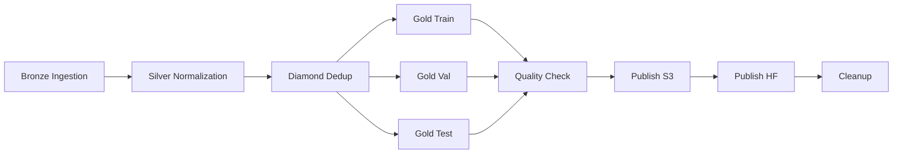

# Airflow DAGs - CORC-NAH

This directory contains Apache Airflow DAGs for orchestrating the CORC-NAH ETL pipeline.

Airflow is an **open-source** alternative to proprietary orchestrators like Control-M, providing:
- Visual DAG representation
- SLA monitoring
- Retry/error handling
- Parallel task execution
- Web UI for monitoring

---

## 📊 DAGs

### `corc_nah_etl_dag.py`

Complete Medallion architecture pipeline:



**Schedule**: Daily at 02:00 UTC  
**SLA**: 2 hours  
**Retries**: 3 with exponential backoff

**Features**:
- ✅ Parallel execution (train/val/test splits)
- ✅ Email alerts on failure
- ✅ Great Expectations quality checks
- ✅ S3 + HuggingFace publishing
- ✅ Automatic cleanup

---

## 🚀 Local Setup

### Prerequisites

- Docker & Docker Compose
- 8 GB RAM minimum

### Quick Start

```bash
# Navigate to project root
cd corc-nah-enterprise/

# Start Airflow (all services)
docker-compose up -d

# Check status
docker-compose ps

# Access web UI
open http://localhost:8080

# Login credentials
# Username: admin
# Password: admin
```

### Manual Setup (without Docker)

```bash
# Install Airflow
pip install apache-airflow==2.8.0

# Initialize database
export AIRFLOW_HOME=$(pwd)/airflow_home
airflow db init

# Create admin user
airflow users create \
    --username admin \
    --password admin \
    --firstname Admin \
    --lastname User \
    --role Admin \
    --email admin@example.com

# Start scheduler (background)
airflow scheduler &

# Start webserver
airflow webserver --port 8080
```

Access UI: http://localhost:8080

---

## 📁 Project Structure

```
airflow_dags/
├── corc_nah_etl_dag.py       # Main ETL DAG
├── README.md                  # This file
└── (future DAGs)              # Additional orchestration workflows
```

---

## ⚙️ Configuration

### Environment Variables

Set in `.env` or Docker Compose:

```bash
# Airflow Core
AIRFLOW__CORE__EXECUTOR=LocalExecutor
AIRFLOW__CORE__LOAD_EXAMPLES=False
AIRFLOW__CORE__DAGS_FOLDER=/opt/airflow/airflow_dags

# Email Alerts (optional)
AIRFLOW__SMTP__SMTP_HOST=smtp.gmail.com
AIRFLOW__SMTP__SMTP_PORT=587
AIRFLOW__SMTP__SMTP_USER=your-email@gmail.com
AIRFLOW__SMTP__SMTP_PASSWORD=your-app-password

# AWS (for S3 publishing)
AWS_ACCESS_KEY_ID=your-key
AWS_SECRET_ACCESS_KEY=your-secret
AWS_DEFAULT_REGION=us-east-1
```

### Connections

Configure in Airflow UI → Admin → Connections:

1. **AWS**  
   - Conn ID: `aws_default`
   - Conn Type: `Amazon Web Services`
   - Extra: `{"region_name": "us-east-1"}`

2. **PostgreSQL** (example for connectors)  
   - Conn ID: `postgres_production`
   - Conn Type: `Postgres`
   - Host: `prod-db.company.com`
   - Schema: `analytics`
   - Login/Password: (from vault)

---

## 🔄 Running DAGs

### Via Web UI

1. Navigate to http://localhost:8080
2. Enable DAG: Toggle `corc_nah_etl_pipeline` to ON
3. Trigger manually: Click ▶️ button
4. Monitor: Click DAG name → Graph view

### Via CLI

```bash
# List DAGs
docker-compose exec airflow-webserver airflow dags list

# Test specific task
docker-compose exec airflow-webserver \
    airflow tasks test corc_nah_etl_pipeline bronze_ingestion 2026-02-03

# Trigger full DAG
docker-compose exec airflow-webserver \
    airflow dags trigger corc_nah_etl_pipeline

# Check logs
docker-compose exec airflow-webserver \
    airflow tasks logs corc_nah_etl_pipeline bronze_ingestion 2026-02-03
```

---

## 📊 Comparison: Airflow vs Jenkins vs Control-M

| Feature | Control-M | Jenkins | Airflow |
|---------|-----------|---------|---------|
| **Cost** | ❌ $50k+/year | ✅ Free (open-source) | ✅ Free (open-source) |
| **UI** | ✅ Enterprise-grade | ⚠️ Basic | ✅ Modern, intuitive |
| **DAG Visualization** | ✅ Native | ⚠️ Plugins only | ✅ Native |
| **Scheduling** | ✅ Advanced cron | ✅ Cron | ✅ Cron + dynamic |
| **Data-focused** | ⚠️ General purpose | ❌ CI/CD-focused | ✅ **Built for ETL** |
| **Dependencies** | ✅ Complex chains | ⚠️ Pipelines | ✅ DAG-native |
| **SLA Monitoring** | ✅ Yes | ⚠️ Manual | ✅ Built-in |
| **Cloud Integration** | ⚠️ Limited | ⚠️ Manual | ✅ Native (AWS, GCP, Azure) |
| **Community** | ❌ Proprietary | ✅ Large | ✅ **Very active** |
| **Learning Curve** | Medium | Low | Medium |

**Verdict**: Airflow is the **best open-source choice** for data pipelines.

---

## 🧪 Testing DAGs

### Validate DAG syntax

```bash
# Python syntax
python airflow_dags/corc_nah_etl_dag.py

# Airflow DAG validation
airflow dags test corc_nah_etl_pipeline 2026-02-03
```

### Test individual tasks

```bash
# Test Bronze ingestion
airflow tasks test corc_nah_etl_pipeline bronze_ingestion 2026-02-03

# Test Python operator
airflow tasks test corc_nah_etl_pipeline silver_normalization 2026-02-03
```

---

## 📈 Monitoring

### Key Metrics

- **DAG Run Duration**: Should be <2h (SLA)
- **Task Success Rate**: Should be >98%
- **Data Volume**: Track input/output records per layer

### Airflow Metrics

Access via UI or REST API:

```python
# Example: Get DAG run history
from airflow.api.client.local_client import Client

client = Client(None, None)
dag_runs = client.get_dag_runs('corc_nah_etl_pipeline')

for run in dag_runs:
    print(f"{run['execution_date']}: {run['state']}")
```

### Log Aggregation

For production, integrate with ELK/Splunk:

```yaml
# docker-compose.yml
volumes:
  - ./logs:/opt/airflow/logs  # Mount logs for external processing
```

---

## 🚀 Production Deployment

### Option 1: Docker Swarm

```bash
# Deploy to Swarm cluster
docker stack deploy -c docker-compose.prod.yml corc-nah-airflow
```

### Option 2: Kubernetes (Helm)

```bash
# Add Airflow Helm repo
helm repo add apache-airflow https://airflow.apache.org
helm repo update

# Install
helm install corc-nah-airflow apache-airflow/airflow \
    --set dags.gitSync.enabled=true \
    --set dags.gitSync.repo=https://github.com/saidmoreno808/nahuatl-data-pipeline \
    --set dags.gitSync.branch=main \
    --set dags.gitSync.subPath=airflow_dags
```

### Option 3: Managed Service

- **AWS**: Amazon Managed Workflows for Apache Airflow (MWAA)
- **GCP**: Cloud Composer
- **Azure**: Azure Data Factory (Airflow integration)

---

## 🔐 Security Best Practices

1. **Secrets Management**: Use Airflow Connections, not hardcoded credentials
2. **RBAC**: Enable role-based access control in production
3. **Network**: Run Airflow behind VPN/firewall
4. **Encryption**: Enable Fernet key for secret encryption

```bash
# Generate Fernet key
python -c "from cryptography.fernet import Fernet; print(Fernet.generate_key().decode())"

# Set in airflow.cfg
[core]
fernet_key = your-generated-key
```

---

## 📚 Resources

- [Airflow Documentation](https://airflow.apache.org/docs/)
- [Best Practices Guide](https://airflow.apache.org/docs/apache-airflow/stable/best-practices.html)
- [Airflow Summit](https://www.airflowsummit.org/) - Annual conference
- [Astronomer.io](https://www.astronomer.io/) - Managed Airflow provider

---

## 🤝 Contributing

To add new DAGs:

1. Create file in `airflow_dags/`
2. Import from `airflow` package
3. Define DAG with `with DAG(...) as dag:`
4. Test locally: `airflow dags test <dag_id> <execution_date>`
5. Deploy: Git push (auto-synced in production)

**DAG naming convention**: `{project}_{purpose}_dag.py`

---

## 📄 License

MIT License - See [LICENSE](../LICENSE)
