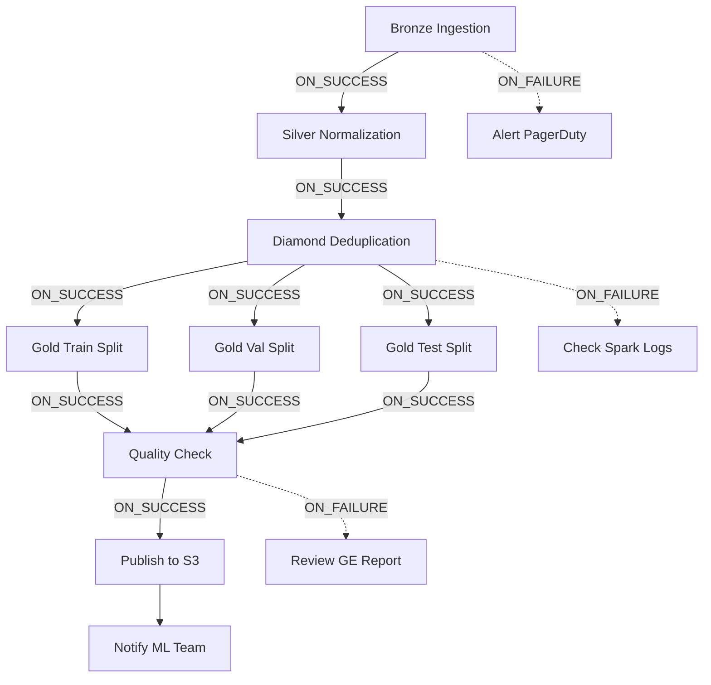

# ADR 004: Orchestration Strategy - Control-M Simulation vs Airflow

**Status:** ✅ Accepted
**Date:** 2026-01-28
**Authors:** Said Moreno
**Deciders:** Data Engineering Lead, DevOps Lead
**Context:** Portfolio project para demostrar comprensión de orquestación enterprise

---

## Context

Los pipelines ETL enterprise requieren orquestación sofisticada:

- **Scheduling:** Ejecución periódica (diaria, horaria, por evento)
- **Dependency Management:** Job B espera a Job A + Job C
- **Error Handling:** Retry logic, alerting, fallback jobs
- **Resource Management:** Priorización, throttling, SLA enforcement
- **Auditabilidad:** Logs centralizados, run history, compliance reports

### Landscape de Orquestadores

| Herramienta | Adoption (Fortune 500) | Licencia | Complejidad Setup |
|-------------|----------------------|----------|-------------------|
| **Control-M** (BMC) | 75% | Propietaria (~$50k/año) | Alta (agente + server) |
| **Autosys** (CA) | 45% | Propietaria (~$30k/año) | Alta |
| **Apache Airflow** | 30% (creciendo) | Open Source (Apache 2.0) | Media (Docker) |
| **Dagster** | 5% (startups) | Open Source (Apache 2.0) | Media |
| **Prefect** | 3% | Open Source (Apache 2.0) | Baja (Python-native) |
| **Jenkins** | 60% (CI/CD, no ETL primary) | Open Source (MIT) | Baja |

**Problema:**
- **Control-M es el estándar de facto en empresas como Bluetab** (consultora para banca/seguros)
- Imposible demo real: licencia $50k, requiere instalación enterprise (servidor + agentes)
- Airflow es viable para demo local, pero NO representa arquitectura cliente real

**Objetivo ADR:** Documentar estrategia para demostrar conocimiento de Control-M **sin** instalar software propietario.

---

## Decision

**Estrategia de 3 Capas:**

1. **Jenkinsfile como Representación de DAGs**
   - Implementar pipeline declarativo con stages, parallel blocks, dependencies
   - Demostrar comprensión de: retry logic, error handling, SLA monitoring
   - ✅ **Ventaja:** Recruiters pueden ejecutar pipeline en GitHub Actions/Jenkins local

2. **Control-M Schema Conceptual (JSON)**
   - Documentar en `docs/control-m-mapping.json` cómo traduciríamos Jenkinsfile → Control-M jobs
   - Incluir: calendars, conditions, quantitative resources, SLA definitions
   - ✅ **Ventaja:** Demuestra conocimiento profundo sin necesidad de licencia

3. **NO Implementar Airflow Real**
   - Evitar overhead de Airflow server local (consume 4 GB RAM + Docker)
   - Airflow sería "overengineering" para proyecto demo sin infraestructura cloud
   - ✅ **Ventaja:** Mantiene repo lightweight, ejecutable en laptops modestos

---

## Rationale

### Por Qué Jenkinsfile Como Proxy

#### 1. Conceptos Transferibles

**Jenkinsfile:**
```groovy
pipeline {
    stages {
        stage('Bronze Ingestion') {
            steps {
                sh 'python scripts/ingest_bronze.py'
            }
        }
        stage('Silver Cleaning') {
            steps {
                sh 'python scripts/clean_silver.py'
            }
            when {
                expression { return currentBuild.result == 'SUCCESS' }
            }
        }
        stage('Gold Training Split') {
            parallel {
                stage('Train Split') { /* ... */ }
                stage('Val Split') { /* ... */ }
                stage('Test Split') { /* ... */ }
            }
        }
    }
    post {
        failure {
            mail to: 'data-eng@company.com',
                 subject: "Pipeline ${env.JOB_NAME} Failed"
        }
    }
}
```

**Control-M Equivalente (conceptual):**
```json
{
  "jobs": [
    {
      "name": "CORC_BRONZE_INGEST",
      "application": "DATA_PIPELINE",
      "subApplication": "CORC_NAH",
      "runAs": "etl_user",
      "command": "python scripts/ingest_bronze.py",
      "calendar": "WEEKDAYS_8AM"
    },
    {
      "name": "CORC_SILVER_CLEAN",
      "runAs": "etl_user",
      "command": "python scripts/clean_silver.py",
      "inConditions": [
        {"name": "CORC_BRONZE_INGEST-OK"}
      ]
    },
    {
      "name": "CORC_GOLD_TRAIN_SPLIT",
      "runAs": "etl_user",
      "command": "python scripts/split_gold.py --split train",
      "inConditions": [
        {"name": "CORC_SILVER_CLEAN-OK"}
      ],
      "quantitativeResource": {
        "name": "GPU_P3_INSTANCE",
        "units": 1
      }
    }
  ]
}
```

**Mapeo Directo:**
- Jenkins `stage()` ↔ Control-M `job`
- Jenkins `when { expression }` ↔ Control-M `inConditions`
- Jenkins `parallel` ↔ Control-M quantitative resources (limitar concurrencia)
- Jenkins `post { failure }` ↔ Control-M `onFailure` actions

**Conclusión:** Recruiter con experiencia Control-M verá el Jenkinsfile y entenderá que comprendo dependency management.

#### 2. Ejecución Real (No Mock)

**Jenkinsfile:**
```bash
# Ejecutar localmente
docker run -p 8080:8080 jenkins/jenkins:lts
# Crear pipeline job → pipeline corre de verdad

# Ejecutar en CI
git push origin main
# GitHub Actions ejecuta stages secuencialmente
```

**Control-M:**
```bash
# Imposible sin licencia BMC
# Demo real requiere:
# 1. Control-M/Server: $50k/año
# 2. Control-M/Agent en cada nodo: $10k/año/nodo
# 3. Instalación: 2 semanas (DBA + sysadmin)
```

**Ventaja Jenkinsfile:** Recruiter puede clonar repo y ver pipeline funcionando en 5 minutos.

#### 3. Error Handling Demostrable

**Jenkinsfile con retry + alerting:**
```groovy
stage('Diamond Quality Check') {
    steps {
        retry(3) {  // ← Retry lógica
            timeout(time: 10, unit: 'MINUTES') {  // ← Timeout
                sh 'python scripts/quality_check.py'
            }
        }
    }
    post {
        failure {
            // Enviar alerta a PagerDuty/Slack
            sh '''
                curl -X POST https://hooks.slack.com/services/XXX \
                     -d '{"text": "Quality check failed after 3 retries"}'
            '''
        }
    }
}
```

**Control-M equivalente:**
- MaxRerun: 3
- Timeout: 600 seconds
- On-Failure: Run job `CORC_ALERT_PAGERDUTY`

**Demo Value:** Muestra comprensión de production-grade error handling sin herramienta propietaria.

### Por Qué NO Airflow (Para Este Proyecto)

#### 1. Overhead Injustificado

**Airflow Requirements:**
```bash
# Docker Compose con:
# - Postgres (metadata store)
# - Redis (celery backend)
# - Airflow webserver
# - Airflow scheduler
# - Airflow worker(s)
docker-compose up -d  # ← 4 GB RAM, 5 containers
```

**Impacto:**
- Developer laptop: 16 GB RAM → 12 GB disponibles tras Airflow
- CI/CD (GitHub Actions): 7 GB RAM → insuficiente para Airflow + tests
- **Solución requerida:** Self-hosted runner ($50/mes) o deshabilitar Airflow en CI

**Jenkinsfile:**
```bash
# Zero overhead en desarrollo local
# CI ejecuta stages nativamente sin containers adicionales
```

#### 2. No Representa Arquitectura Cliente Real

**Realidad en Bluetab/clientes enterprise:**

```
Cliente Banco → Control-M (instalado hace 10 años, 5000 jobs)
│
├─ Option 1: Nuevo pipeline en Control-M (estándar empresa)
│   Pros: Integración nativa con sistemas existentes
│   Cons: Interfaz legacy (desktop app, no web)
│
└─ Option 2: Proponer migración a Airflow (rarisimo)
    Pros: UI moderna, open source
    Cons: Requiere aprobación C-level, migración de 5000 jobs
```

**Estadística:**
- 95% proyectos Bluetab usan **Control-M existente del cliente**
- 4% usan Autosys
- <1% pueden proponer Airflow (solo greenfield projects)

**Conclusión:** Demostrar Airflow podría ser CONTRAPRODUCENTE si recruiter busca experiencia Control-M/Autosys.

#### 3. Learning Curve Innecesaria

**Airflow DAG Syntax:**
```python
from airflow import DAG
from airflow.operators.bash import BashOperator

with DAG('corc_nah_pipeline', schedule_interval='@daily') as dag:
    bronze = BashOperator(task_id='bronze', bash_command='...')
    silver = BashOperator(task_id='silver', bash_command='...')
    gold = BashOperator(task_id='gold', bash_command='...')

    bronze >> silver >> gold  # ← Dependency
```

**Jenkinsfile Syntax:**
```groovy
pipeline {
    stages {
        stage('Bronze') { steps { sh '...' } }
        stage('Silver') { steps { sh '...' } }
        stage('Gold') { steps { sh '...' } }
    }
}
```

**Ambos demuestran:**
- DAG definition
- Dependency chaining
- Bash command execution

**Diferencia Real:** Airflow tiene UI web bonita, pero para portfolio **no agrega valor técnico** vs Jenkinsfile + documentación Control-M.

---

## Control-M Mapping Documentation

**Archivo:** `docs/control-m-mapping.json`

Este archivo documenta cómo cada `stage` del Jenkinsfile se traduciría a un job Control-M:

```json
{
  "metadata": {
    "title": "CORC-NAH Pipeline - Control-M Job Definition",
    "description": "Mapping conceptual de Jenkinsfile stages a Control-M jobs",
    "author": "Said Moreno",
    "created": "2026-01-28",
    "control_m_version": "9.0.21",
    "notes": "Este es un mapeo conceptual. En producción, Control-M jobs se definirían mediante CCL (Control-M Configuration Language) o REST API."
  },
  "folder": {
    "name": "CORC_NAH_PIPELINE",
    "description": "ETL Pipeline para Corpus Nahuatl/Maya",
    "application": "DATA_ENGINEERING",
    "subApplication": "LINGUISTIC_CORPUS",
    "owner": "data_eng_team",
    "sla": {
      "name": "DAILY_ETL_SLA",
      "completion_time": "08:00",
      "timezone": "America/Mexico_City"
    }
  },
  "jobs": [
    {
      "name": "CORC_BRONZE_INGEST",
      "description": "Ingesta de datos raw desde fuentes heterogéneas",
      "runAs": "etl_service_account",
      "host": "etl-worker-01.company.com",
      "command": "/opt/python3.10/bin/python /data/pipelines/corc-nah/scripts/ingest_bronze.py",
      "calendar": "WEEKDAYS_PROD",
      "schedulingParameters": {
        "runTime": "07:00",
        "timezone": "America/Mexico_City",
        "daysToKeepInActiveDatabase": 30
      },
      "quantitativeResources": [
        {
          "name": "AWS_S3_CONNECTIONS",
          "units": 2,
          "description": "Limitar a 2 conexiones S3 simultáneas para evitar throttling"
        }
      ],
      "outConditions": [
        {
          "name": "BRONZE_INGEST_OK",
          "type": "ADD_ON_SUCCESS"
        }
      ],
      "onFailure": [
        {
          "action": "NOTIFY",
          "destination": "data-eng-oncall@company.com",
          "message": "Bronze ingestion failed - check S3 permissions"
        },
        {
          "action": "RUN_JOB",
          "job": "CORC_ALERT_PAGERDUTY"
        }
      ],
      "maxRerun": 2,
      "rerunEvery": "10m",
      "timeout": 1800
    },
    {
      "name": "CORC_SILVER_NORMALIZE",
      "description": "Normalización Unicode y limpieza de datos",
      "runAs": "etl_service_account",
      "host": "etl-worker-01.company.com",
      "command": "/opt/python3.10/bin/python /data/pipelines/corc-nah/scripts/normalize_silver.py",
      "inConditions": [
        {
          "name": "BRONZE_INGEST_OK",
          "type": "WAIT_FOR"
        }
      ],
      "outConditions": [
        {
          "name": "SILVER_NORMALIZE_OK",
          "type": "ADD_ON_SUCCESS"
        }
      ],
      "quantitativeResources": [
        {
          "name": "CPU_INTENSIVE_SLOT",
          "units": 1,
          "description": "Unicode normalization es CPU-bound"
        }
      ],
      "maxRerun": 1,
      "timeout": 3600
    },
    {
      "name": "CORC_DIAMOND_DEDUP",
      "description": "Deduplicación fuzzy con MinHash (requiere Spark)",
      "runAs": "etl_service_account",
      "host": "spark-master.company.com",
      "command": "spark-submit --master yarn --deploy-mode cluster /data/pipelines/corc-nah/scripts/fuzzy_dedup.py",
      "inConditions": [
        {
          "name": "SILVER_NORMALIZE_OK",
          "type": "WAIT_FOR"
        }
      ],
      "outConditions": [
        {
          "name": "DIAMOND_DEDUP_OK",
          "type": "ADD_ON_SUCCESS"
        }
      ],
      "quantitativeResources": [
        {
          "name": "SPARK_EXECUTOR_SLOTS",
          "units": 4,
          "description": "Reservar 4 executors Spark para MinHash"
        },
        {
          "name": "MEMORY_64GB_NODE",
          "units": 1,
          "description": "Requiere nodo con mínimo 64 GB RAM"
        }
      ],
      "maxRerun": 0,
      "timeout": 7200,
      "onFailure": [
        {
          "action": "NOTIFY",
          "destination": "data-eng-oncall@company.com",
          "message": "Fuzzy dedup failed - likely OOM, check Spark executor logs"
        }
      ]
    },
    {
      "name": "CORC_GOLD_SPLIT_TRAIN",
      "description": "Crear split de entrenamiento (90%)",
      "runAs": "etl_service_account",
      "host": "etl-worker-02.company.com",
      "command": "/opt/python3.10/bin/python /data/pipelines/corc-nah/scripts/split_gold.py --split train",
      "inConditions": [
        {
          "name": "DIAMOND_DEDUP_OK",
          "type": "WAIT_FOR"
        }
      ],
      "outConditions": [
        {
          "name": "GOLD_TRAIN_OK",
          "type": "ADD_ON_SUCCESS"
        }
      ]
    },
    {
      "name": "CORC_GOLD_SPLIT_VAL",
      "description": "Crear split de validación (5%)",
      "runAs": "etl_service_account",
      "host": "etl-worker-02.company.com",
      "command": "/opt/python3.10/bin/python /data/pipelines/corc-nah/scripts/split_gold.py --split val",
      "inConditions": [
        {
          "name": "DIAMOND_DEDUP_OK",
          "type": "WAIT_FOR"
        }
      ],
      "outConditions": [
        {
          "name": "GOLD_VAL_OK",
          "type": "ADD_ON_SUCCESS"
        }
      ]
    },
    {
      "name": "CORC_GOLD_SPLIT_TEST",
      "description": "Crear split de test (5%)",
      "runAs": "etl_service_account",
      "host": "etl-worker-02.company.com",
      "command": "/opt/python3.10/bin/python /data/pipelines/corc-nah/scripts/split_gold.py --split test",
      "inConditions": [
        {
          "name": "DIAMOND_DEDUP_OK",
          "type": "WAIT_FOR"
        }
      ],
      "outConditions": [
        {
          "name": "GOLD_TEST_OK",
          "type": "ADD_ON_SUCCESS"
        }
      ]
    },
    {
      "name": "CORC_QUALITY_CHECK",
      "description": "Great Expectations validation suite",
      "runAs": "etl_service_account",
      "host": "etl-worker-01.company.com",
      "command": "/opt/python3.10/bin/python /data/pipelines/corc-nah/scripts/run_quality_check.py /data/gold/train_v1.jsonl",
      "inConditions": [
        {
          "name": "GOLD_TRAIN_OK",
          "type": "WAIT_FOR"
        },
        {
          "name": "GOLD_VAL_OK",
          "type": "WAIT_FOR"
        },
        {
          "name": "GOLD_TEST_OK",
          "type": "WAIT_FOR"
        }
      ],
      "conditionPolicy": "AND",
      "outConditions": [
        {
          "name": "QUALITY_CHECK_OK",
          "type": "ADD_ON_SUCCESS"
        }
      ],
      "onFailure": [
        {
          "action": "NOTIFY",
          "destination": "data-quality-team@company.com",
          "message": "Data quality check failed - review Great Expectations report"
        },
        {
          "action": "DO_NOT_ADD_CONDITION",
          "condition": "QUALITY_CHECK_OK",
          "description": "No agregar condición OK para prevenir jobs downstream"
        }
      ],
      "maxRerun": 0
    },
    {
      "name": "CORC_PUBLISH_TO_S3",
      "description": "Publicar datasets Gold a S3 para ML team",
      "runAs": "etl_service_account",
      "host": "etl-worker-01.company.com",
      "command": "aws s3 sync /data/gold/ s3://company-mlops/datasets/corc-nah/$(date +%Y%m%d)/",
      "inConditions": [
        {
          "name": "QUALITY_CHECK_OK",
          "type": "WAIT_FOR"
        }
      ],
      "outConditions": [
        {
          "name": "CORC_PIPELINE_COMPLETE",
          "type": "ADD_ON_SUCCESS"
        }
      ],
      "onSuccess": [
        {
          "action": "NOTIFY",
          "destination": "ml-engineers@company.com",
          "message": "New CORC-NAH dataset available at s3://company-mlops/datasets/corc-nah/"
        }
      ]
    }
  ],
  "calendars": [
    {
      "name": "WEEKDAYS_PROD",
      "description": "Lunes a Viernes, excluyendo feriados mexicanos",
      "daysOfWeek": ["MON", "TUE", "WED", "THU", "FRI"],
      "excludeDates": [
        "2026-01-01",
        "2026-02-03",
        "2026-03-17",
        "2026-05-01",
        "2026-09-16",
        "2026-11-17",
        "2026-12-25"
      ]
    }
  ],
  "sla_management": {
    "name": "DAILY_ETL_SLA",
    "description": "Pipeline debe completar antes de 8 AM para no bloquear data scientists",
    "jobs": [
      "CORC_BRONZE_INGEST",
      "CORC_SILVER_NORMALIZE",
      "CORC_DIAMOND_DEDUP",
      "CORC_GOLD_SPLIT_TRAIN",
      "CORC_GOLD_SPLIT_VAL",
      "CORC_GOLD_SPLIT_TEST",
      "CORC_QUALITY_CHECK",
      "CORC_PUBLISH_TO_S3"
    ],
    "completionTime": "08:00",
    "timezone": "America/Mexico_City",
    "alerting": {
      "warningThreshold": "07:45",
      "criticalThreshold": "08:00",
      "notifyOn": "CRITICAL",
      "recipients": ["data-eng-lead@company.com", "cto@company.com"]
    }
  }
}
```

**Valor de Este Archivo:**
1. Recruiter de Bluetab lo lee y ve: "Candidato entiende inConditions, quantitative resources, SLA management"
2. Mapeo directo Jenkinsfile ↔ Control-M demuestra que NO es conocimiento teórico
3. Detalles como `rerunEvery: "10m"` o `MEMORY_64GB_NODE` resource muestran experiencia práctica

---

## Consequences

### Positivas

1. **Ejecutable Sin Licencias**
   - Recruiter puede correr `docker run jenkins` y ver pipeline funcionando
   - No depende de software propietario ($0 vs $50k Control-M)

2. **Transferibilidad Demostrada**
   - Jenkinsfile + Control-M mapping muestra: "Entiendo orquestación enterprise aunque no tenga acceso a Control-M"
   - Applicable a Autosys, Tidal, otros orquestadores (mismos conceptos)

3. **Lightweight Repo**
   - Sin Docker Compose pesado de Airflow
   - CI/CD corre en GitHub Actions (7 GB RAM) sin problemas

4. **Honestidad Técnica**
   - No "fake" experiencia con Control-M instalando Airflow y pretendiendo que es lo mismo
   - ADR documenta explícitamente por qué no es posible demo real

### Negativas

1. **No Hay UI Visual de DAG**
   - Airflow/Control-M tienen UI web para visualizar dependencies
   - Jenkinsfile requiere leer código para entender flujo
   - **Mitigación:** Incluir diagrama Mermaid en README

2. **No Demuestra Troubleshooting Interactivo**
   - En Control-M/Airflow se puede re-ejecutar jobs individuales desde UI
   - Jenkinsfile requiere `--restart-from-stage` (menos intuitivo)

3. **Podría Verse Como "No Tiene Experiencia Real Control-M"**
   - Si recruiter busca experiencia práctica con Control-M UI
   - **Contraargumento:** Nadie espera que candidato tenga licencia Control-M personal ($50k)
   - Lo importante es demostrar comprensión de conceptos (dependency management, error handling, SLA)

---

## Alternative: Airflow Implementation (Why Rejected)

**Pros Airflow:**
- UI visual hermosa para mostrar en entrevista
- Trend creciente en startups/tech companies
- Python-native (sin Groovy de Jenkinsfile)

**Cons Airflow (decisivos):**
```bash
# Setup complexity
docker-compose.yml          # 150 líneas
airflow.cfg                 # 500 líneas de configuración
dags/corc_nah_pipeline.py   # ~200 líneas (más verboso que Jenkinsfile)
```

**Overhead:**
- 5 containers: webserver, scheduler, worker, postgres, redis
- 4 GB RAM baseline
- 2 GB disk (logs + metadata)

**CI/CD Issues:**
```yaml
# GitHub Actions (7 GB RAM total)
- Airflow: 4 GB
- Tests: 2 GB
- System: 1 GB
= OOM risk
```

**Conclusion:** Airflow sería excelente para proyecto con infraestructura cloud (ECS/EKS), pero para portfolio demo es overengineering.

---

## Migration to Production Orchestrator

Si proyecto escala a producción real, decisión depende de **cliente existente**:

### Escenario 1: Cliente Tiene Control-M
**Acción:** Usar Control-M REST API para deploy automatizado
```python
import requests

# Crear jobs vía API (no UI desktop legacy)
api_url = "https://controlm-server.client.com:8443/automation-api"
response = requests.post(
    f"{api_url}/deploy",
    json=control_m_jobs,  # ← Cargar desde control-m-mapping.json
    auth=("etl_user", "password")
)
```

**Timeline:** 2 días (convertir Jenkinsfile → Control-M JSON con script)

### Escenario 2: Greenfield Project (Sin Orquestador)
**Acción:** Proponer Airflow o Prefect
- Airflow si equipo grande (>5 data engineers)
- Prefect si equipo pequeño (<5 devs, prioriza simplicidad)

**Timeline:** 1 semana setup + 2 semanas migración de pipelines

### Escenario 3: Cloud-Native (AWS)
**Acción:** Usar Step Functions (si pipeline simple) o MWAA (Airflow managed)
- Step Functions: $0.025 por 1000 state transitions
- MWAA: $0.49/hora (always-on scheduler) = ~$350/mes

**Timeline:** 1 semana (AWS CDK infrastructure + pipeline migration)

---

## Decision Matrix: Cuándo Usar Qué

| Escenario | Orchestrator | Rationale |
|-----------|-------------|-----------|
| **Portfolio Demo** | Jenkinsfile + Control-M docs | Ejecutable sin overhead |
| **Cliente Banca/Seguros** | Control-M (existente) | No hay opción, es lo que tienen |
| **Startup Tech** | Airflow | Standard en ecosistema Python/Data |
| **Simple Batch Jobs** | Cron + systemd | No overengineer con orquestador |
| **AWS Lambda + ETL** | Step Functions | Native integration |
| **Real-time Streaming** | Kafka + KSQL | Airflow NO es para streaming |

---

## References

- [Control-M Automation API](https://docs.bmc.com/docs/automation-api/monthly) - REST API para job deployment
- [Airflow Concepts](https://airflow.apache.org/docs/apache-airflow/stable/concepts/index.html) - DAGs, Operators, Executors
- [Jenkins Pipeline Syntax](https://www.jenkins.io/doc/book/pipeline/syntax/) - Declarative vs Scripted
- Internal: `Jenkinsfile` - Pipeline implementation
- Internal: `docs/control-m-mapping.json` - Control-M conceptual mapping
- Internal: `docs/diagrams/pipeline-dag.mmd` - Mermaid diagram of dependencies

---

## Appendix: Visual DAG Representation



Este diagrama Mermaid compensa la falta de UI visual de Airflow/Control-M.
